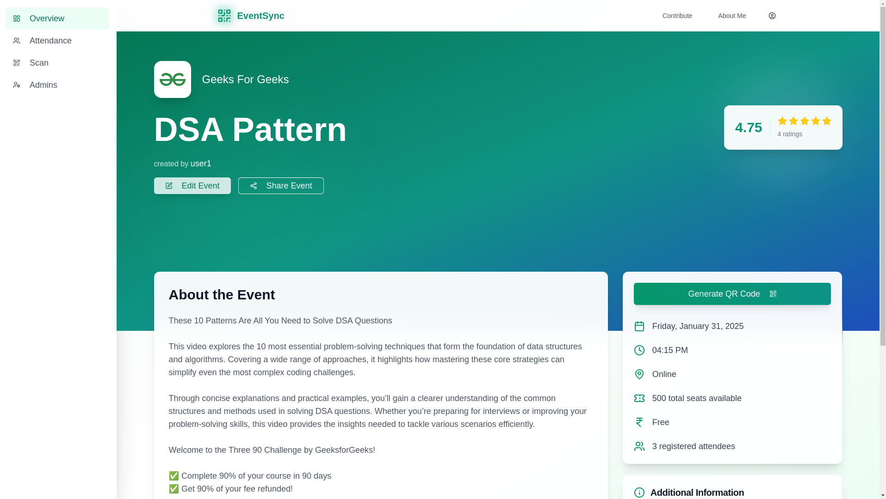

# Event Sync

**Event Sync** is a powerful event management platform that enables users to create and manage events seamlessly. It offers real-time attendance tracking, event registration forms, QR-based ticket validation, and automated email confirmations. The platform is designed to enhance event organization with advanced tools like Google Calendar integration, data analytics, and attendance exports.

---

## 🚀 Features

### 🎟️ Event Creation & Registration

- Create multiple events with detailed information.
- Generate and share event-specific QR codes for easy access.
- Custom registration forms for attendees.

### 🔐 Authentication & Security

- Email OTP verification for secure user sign-up.
- Strong authentication and authorization mechanisms.
- Automatic confirmation emails upon successful registration, with ticket QR code attachment.

### 📊 Attendance & Data Management

- Real-time attendance tracking with analytics.
- Export attendance data in Excel format with a single click.
- QR code scanning system for quick check-ins and auto-verification.

### 📅 Integrations & Admin Controls

- Google Calendar setup for event scheduling.
- Multi-admin event management with shared access controls.
- Seamless event coordination among multiple admins.

---

## 📸 Screenshots





---

## 📈 Upcoming Features

- 📽️ Upload and present PowerPoint slides within the platform.
- 📩 Custom mass email functionality for event attendees.
- 💳 Integrated payment gateway for paid events.
- 📝 Better registration form builder

---

## 💻 Contribution Guide

### Local Setup

1. Clone the repository:
   ```sh
   git clone https://github.com/your-repo/event-sync.git
   ```
2. Navigate to the server directory:
   ```sh
   cd apps/server
   ```
3. Create a `.env` file and add the required environment variables:
   ```sh
   DATABASE_URL=<your_database_url>
   ```
4. Go back to the root directory and set up dependencies:
   ```sh
   npm run setup
   ```
5. Start the development server:
   ```sh
   npm run dev
   ```

### Docker Setup (not available yet)

1. Run the application using Docker:
   ```sh
   docker compose up
   ```

---

## 📢 Additional Information

For any queries, feature requests, or contributions, feel free to open an issue or submit a pull request. Stay tuned for upcoming updates!

---

## 🔗 Connect on Socials:

- Portfolio- https://itzsouvik.com/
- GitHub- https://github.com/Souvik9205
- Instagram- https://www.instagram.com/souvik_23_/
- LinkedIn- https://www.linkedin.com/in/souvik9205/

<br />
Happy coding! 🎉
